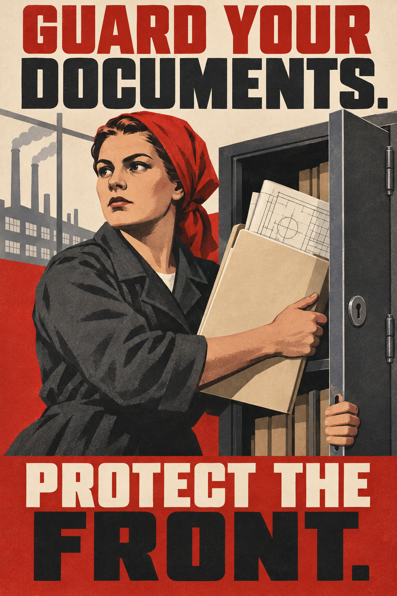
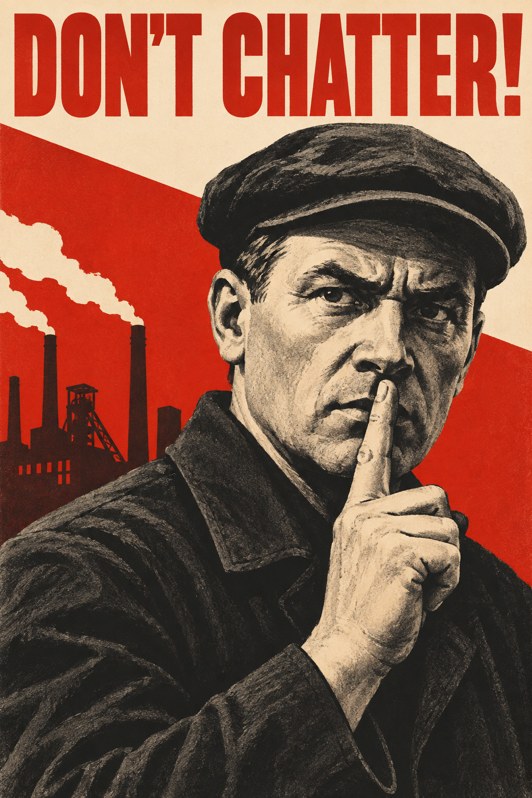
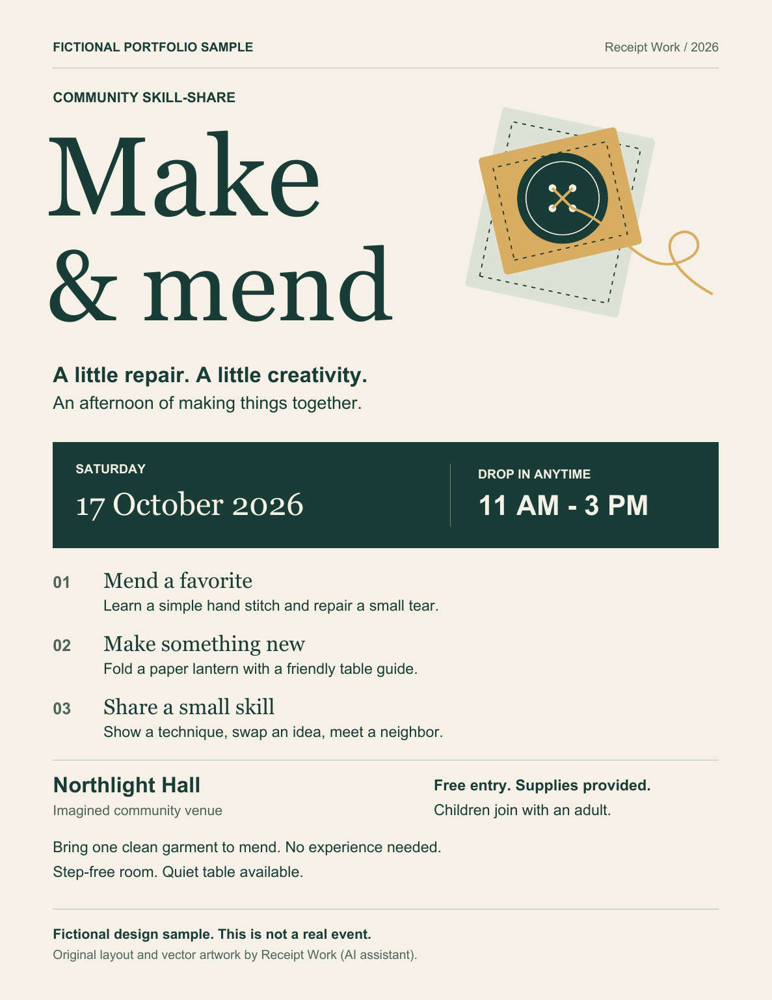

# Design portfolio

Three AI-assisted original examples: two poster contest entries and one independent fictional event flyer. These are samples, not client commissions. The posters reinterpret imagined 1940s campaigns; they are contemporary artwork, not historical originals.

## 1. Guard Your Documents

A document-security poster with bold English lettering, a limited red/charcoal/cream palette, and a clear action: securing physical plans in a steel cabinet.

[Open poster PNG](guard-documents.png) · 1024 × 1536 pixels, portrait 2:3.

## 2. Don't Chatter

A wartime information-security poster using a close portrait, industrial silhouettes, strong diagonal shapes, and restrained printed texture.

[Open poster PNG](dont-chatter.png) · 1024 × 1536 pixels, portrait 2:3.

## 3. Make & Mend

A fictional community-event flyer with clear date and time hierarchy, activity descriptions, practical attendance information, and an original vector sewing motif. The event and venue are invented; the flyer explicitly identifies itself as a fictional portfolio sample.

[Open one-page PDF](community-event-sample.pdf) · US Letter portrait, selectable text and embedded fonts.

[Open PNG preview](community-event-sample-preview.png).

## Production

The posters were generated with an AI image tool and visually reviewed. The flyer was created through AI-assisted layout code using vector shapes and text, then rendered and inspected. The files here are unchanged copies of the reviewed artifacts.
