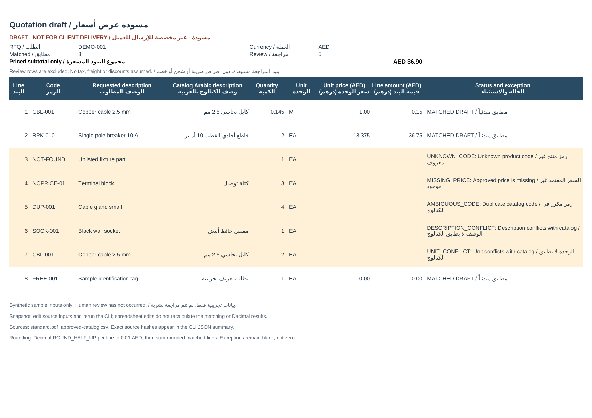

# RFQ quotation engine demo

An original **uncommissioned, AI-assisted demonstration** using fictional electrical-parts data. No paid-client delivery, real buyer files, completed human review or production readiness is claimed. All results are quotation drafts.

This folder contains a Python engine: one documented text-based PDF layout plus an approved-price CSV produces a bilingual English/Arabic XLSX draft in AED. The separate `../n8n/` folder contains workflow integration when included in the repository.

## Run after cloning

Use Python 3.12 (tested). From the **`rfq-demo/` directory**:

```sh
python3 -m venv .venv
. .venv/bin/activate
python3 -m pip install -r engine/requirements.txt

python3 engine/quote.py \
  --pdf engine/fixtures/standard.pdf \
  --catalog engine/fixtures/approved-catalog.csv \
  --output engine/sample-output/quotation-draft.xlsx

python3 -m unittest discover -s engine/tests -v
```

On Windows, activate the environment with `.venv\Scripts\activate` instead. There is no service subscription or external API in the engine. Runtime packages are `pdfplumber` and `openpyxl`; `reportlab` is used to regenerate the synthetic fixtures. Package installation requires internet access; running the engine with installed dependencies does not.

The CLI prints one JSON summary and exits **0 for a successfully generated draft, including drafts with review rows**. Unsupported PDF/layout, malformed catalog or file failures exit **2**, return `status:error`, and preserve an existing output. Incorrect/missing command-line arguments use ordinary argparse stderr help and exit 2. Successful runs atomically replace the explicitly selected `.xlsx` output path.

The JSON includes extracted rows, status/reason codes, matched and exception counts, matched-only subtotal, and SHA256 hashes of the PDF, catalog and XLSX. Its output path is absolute at runtime. The included sample JSON changes that field to a portable relative path; all sample artifact hashes are retained.

## Included sample

[Download the XLSX draft](sample-output/quotation-draft.xlsx) · [JSON result](sample-output/standard-result.json) · [Preview PNG](preview.png)



| Input fixture | Rows | Matched | Review | Matched-only subtotal |
|---|---:|---:|---:|---:|
| [standard.pdf](fixtures/standard.pdf) | 8 | 3 | 5 | AED 36.90 |
| [unseen.pdf](fixtures/unseen.pdf) | 4 | 3 | 1 | AED 56.89 |

Standard row amounts: `0.15`, `36.75`, five blank exception amounts, then `0.00`. The five held rows cover unknown code, missing price, duplicate catalog code, conflicting description and conflicting unit. The zero-priced matched item remains numeric zero.

The second fixture uses different rows and quantities in the same layout. “Unseen” means a separate synthetic fixture created by the same AI assistant; it is **not** a blind real-customer acceptance test. [Expected results](fixtures/expected-results.json) list both fixtures' exact amounts and reasons.

## Exact supported input layout

One **text-based PDF page**, 1–25 rows, maximum 10 MB. Request descriptions are English. Required nonblank lines:

```text
RFQ-DEMO-V1
SYNTHETIC SAMPLE - NOT A CUSTOMER REQUEST
RFQ-ID: DEMO-001
CURRENCY: AED
CODE | DESCRIPTION | QTY | UNIT
CBL-001 | Copper cable 2.5 mm | 0.145 | M
END-RFQ
```

Rows have exactly four pipe-separated fields, no embedded pipes and no wrapped lines. Outer whitespace is stripped. Code length is at most 40 characters, description 100, unit 16. IDs contain 1–40 ASCII letters/digits, underscores or hyphens. Empty code/description/unit, unexpected text, missing markers or multiple pages fail the file rather than silently skipping a line. Invalid/missing quantity becomes a row exception. Run `python3 engine/generate_fixtures.py` to recreate the fictional examples.

This is deliberately one synthetic layout. OCR, scans, arbitrary tables, multipage requests and Arabic PDF extraction are not supported. A real customer layout requires agreed extraction rules and fresh tests.

## Approved catalog and matching rules

[The sample CSV](fixtures/approved-catalog.csv) is UTF-8, with this exact header order:

```text
code,description_en,description_ar,unit,unit_price_aed,price_approved
```

Maximum catalog size: 5 MB. Approval markers in this fictional CSV are test inputs, **not evidence of human or client approval**. A real deployment must use buyer-authorized data and prices.

- Codes match exactly and case-sensitively after trimming outer whitespace. No fuzzy code lookup or product substitution.
- Every duplicate catalog code is ambiguous, including identical duplicate rows. The engine never chooses the first result.
- English descriptions must match after whitespace collapse and case folding only. Changed specifications or wording are held. Units match exactly, without conversion or alias inference.
- English/Arabic catalog descriptions and the unit are required. Arabic output comes directly from the supplied catalog; the engine performs no automatic translation.
- `price_approved` must equal `yes`. Blank price, invalid price and unapproved price are separate exceptions. Approved zero is valid.
- Any exception leaves both quoted unit price and amount blank. The row and reason remain visible. No alternate product is inserted.

## AED calculation and spreadsheet behavior

Quantities are positive decimal strings; prices are nonnegative. Both allow at most six fractional digits and values up to 1,000,000. No exponent notation, comma decimal guessing, NaN, infinity or negative values.

The engine uses Python `Decimal` from strings. It rounds each quantity × unit price to `0.01` AED with **`ROUND_HALF_UP`**, then sums the rounded matched amounts. **`0.145 × 1.00 = 0.15 AED`.** Exception rows are excluded from the explicitly labeled subtotal. No tax, VAT, freight or discounts are assumed.

The XLSX is a **typed numeric snapshot**, not a live pricing calculator. Edit source files and rerun the CLI to update matching or calculations. Monetary results do not depend on Excel formulas or binary-float multiplication. Imported text is stored literally so formula-like product text cannot become an executable spreadsheet formula.

The sheet contains bilingual headings and reasons, draft status, requested and catalog descriptions, quantity/unit, AED amounts, an auto-filter and frozen headers. Arabic-capable fonts are needed in the spreadsheet viewer. No human linguistic review is claimed.

## Verification and limits

[Ten automated tests passed](qa/tests.txt): half-up boundaries, exact codes, conflicts, unknown/missing/duplicate catalog data, invalid values, unapproved and zero prices, held-out fixture, one-row layout, numeric/bilingual XLSX contents, formula-like text, JSON exit behavior and fatal-error output preservation.

Both PDFs were rendered and visually inspected. The saved XLSX was reopened for data checks and rendered with Artifact Tool and LibreOffice Calc. The included preview is the final one-page native LibreOffice rendering: Arabic text, amounts, blank exceptions and draft labels are visible. This is agent-operated QA, not a human review or a Microsoft Excel compatibility certification.

No OCR, semantic matching, substitutions, human-approval system, tax logic, ERP, customer email, backend service or production deployment is included in this engine. The separate integration folder documents its own n8n evidence. No buyer acceptance or income is implied.
