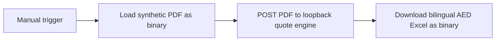

# Local n8n RFQ integration

Original synthetic demonstration for review before any paid commission. It sends an actual PDF binary through n8n to the local Python engine and retrieves the generated bilingual AED Excel workbook. The approved catalogue is an explicitly allowlisted local fixture.

## Components

- `workflow-standard.json` and `workflow-unseen.json`: importable, inactive n8n workflows. Each has Manual Trigger → HTTP Request for PDF → HTTP Request with binary PDF body → HTTP Request for XLSX binary.
- `wrapper.py`: Python standard-library HTTP adapter, bound only to `127.0.0.1:8792`. It invokes `../engine/quote.py` with an argument list, without a shell or arbitrary caller-supplied paths.
- `cli.sh`: isolated n8n configuration; local state stays under `runtime/state`. Telemetry, templates, community packages and license auto-renewal are disabled. Only loopback is excepted from enabled SSRF address protections.
- `run-demo.sh`: imports a workflow, then uses the supported current `execute --id` CLI. No deprecated Execute Command node or `execute --file` flag.
- `test-wrapper.py`: actual HTTP/binary contract checks against the running adapter.

## Reproduce

Prerequisites: Node.js >=24 (actual tested version recorded in `TEST_REPORT.md`), npm, and Python with the engine's pinned dependencies. n8n is pinned to **2.39.5**. The runtime is installed from the official npm package; it is not redistributed as part of this original source.

From this directory, prepare a Python environment and restore the pinned npm lockfile:

```sh
python3 -m venv .venv
. .venv/bin/activate
python -m pip install -r ../engine/requirements.txt
bash install-runtime.sh
python3 wrapper.py
```

Keep the adapter running. In another terminal, from this directory:

```sh
bash run-demo.sh standard
bash run-demo.sh unseen
python3 test-wrapper.py
```

`python3` must have `pdfplumber` and `openpyxl`, as documented by the engine. Launching the wrapper with that interpreter also selects it for the engine. Alternatively set `RFQ_PYTHON` to an interpreter path. `RFQ_NODE` can select a Node executable for the n8n CLI.

The result of the Create AED review draft node includes counts, exceptions, subtotal, input/catalogue/output SHA-256 values and a local artifact URL. The final node downloads the workbook into n8n binary data. Outputs are also available under `artifacts/<run-id>/quote.xlsx`, with `summary.json` and the exact received `rfq.pdf`. A new run ID prevents overwriting earlier results.



Actual sanitized execution records and the exact workbooks retrieved by n8n are in `evidence/`. `summarize-execution.py standard` or `unseen` can regenerate the evidence from an explicitly saved `evidence/<fixture>-raw.log`, verifying the real files in n8n's local binary store against the engine hashes. Raw logs must remain private because n8n includes internal execution state.

To inspect the workflow in the optional local editor after import, run `bash cli.sh start` and open `http://127.0.0.1:8793`. This is not required for the tested CLI path; editor onboarding and screenshot verification are separate checks. Run the editor or a CLI execution one at a time: current n8n starts its internal task broker even though these HTTP-only workflows contain no Code node. Its loopback broker port is isolated at `8794`.

## HTTP contract

`GET /fixtures/standard.pdf` or `/fixtures/unseen.pdf` returns an original synthetic PDF. `POST /quote?catalog=approved` accepts `application/pdf` with a body no larger than 2 MiB. The adapter uses `../engine/fixtures/approved-catalog.csv`, returns a draft/review summary, and exposes only its generated UUID workbook through `GET /artifacts/<uuid>/quote.xlsx`. Invalid content returns an error status instead of a success workbook. Browser-origin POSTs and arbitrary catalogue/file paths are rejected. No authentication, external exposure or production input support is configured in this local demonstration.

## Limits and handover

This demonstrates a synthetic agreed layout, not general PDF understanding, OCR or a client deployment. The engine owns parsing, monetary arithmetic, row exceptions and bilingual workbook content; see its guide/tests for limitations. A real pilot requires representative files, agreed catalogue/rounding rules, an unseen same-layout acceptance PDF, a defined support period and a payment agreement.

If n8n runs on another host or in Docker, `127.0.0.1` refers to that environment; these URLs require a separately agreed deployment adaptation. Do not expose this unauthenticated demo adapter publicly. No SaaS account, client credentials, paid API, email sending or ERP write occurs in the workflow.

For publication, include the workflows, adapter/scripts, evidence summaries and source documentation. Exclude `runtime/`, raw logs, SQLite state and generated local encryption configuration. Keep n8n's own license separate from the original integration code's license.

## Primary references

- [Official npm package](https://www.npmjs.com/package/n8n/v/2.39.5) — exact runtime version and Node requirement.
- [HTTP Request node documentation](https://docs.n8n.io/integrations/builtin/core-nodes/n8n-nodes-base.httprequest/) — binary request bodies and file responses.
- Current installed official package source: `n8n/dist/commands/execute.js`, `n8n/dist/commands/import/workflow.js`, `@n8n/config/dist/configs/ssrf-protection.config.js` — used to verify supported CLI flags and loopback allowlist configuration. Older hosting documentation URLs have moved.
