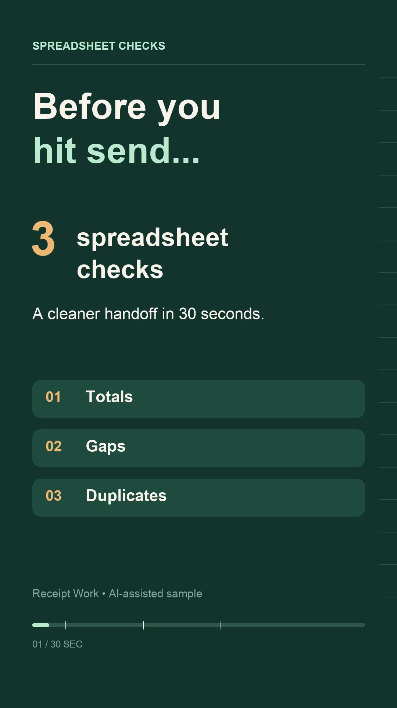

# Video portfolio

## 3 spreadsheet checks before you send

An original AI-assisted, 30-second vertical motion-graphic sample with visible captions. It covers checking totals, finding required blanks, and reviewing duplicate IDs. This is an independent portfolio demonstration, not client work. The example values and IDs are invented.

**[Play or download the MP4](spreadsheet-checks-short.mp4?raw=true)**

[Open the preview PNG](spreadsheet-checks-frame-intro.png)

### Specifications

| Item | Details |
|---|---|
| Duration | 30 seconds |
| Picture | 1080 × 1920 pixels, vertical 9:16 |
| Encoding | MP4, H.264, yuv420p, 30 fps |
| Audio | Silent; all advice appears as on-screen text |
| File size | 774,731 bytes |

### Production and checks

The copy and vector-like graphics were created through AI-assisted Python animation code, rendered with Pillow and encoded with FFmpeg. No client data, logos or third-party media were used. The video includes the label “Receipt Work • AI-assisted sample”.

Format checks confirmed the specifications and 900 frames. Technical playback verification decoded the full video without reported errors. Visual QA inspected actual encoded frames from the opening, each of the three tips, and the final recap; captions were readable with no observed clipping or overlap.

[View the rendering source](spreadsheet-checks-short.py). It requires Python, Pillow, FFmpeg with libx264, and the fonts named in the source; font paths may need adjustment on another system.
